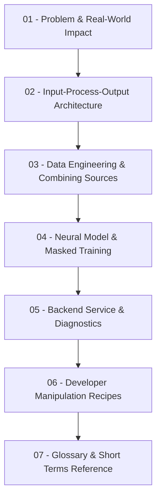

# 🗺️ CTDI Project Knowledge Base: Map of Content (MOC)

> [!ABSTRACT] Overview
> Welcome to the modular documentation for the **CTDI Air Pollution Imputation System**. This knowledge base breaks down the entire research framework, mathematics, data pipeline, and backend services into self-contained, linked modules for easy navigation in Obsidian.
> 
> 🌟 **Master Monolithic Document**: For the complete chronological chat log, engineering diagnoses, and full 5-phase research vision in one place, read:
> 👉 **[[Complete Project Documentation & Vision]]**

---

## 📚 Modular Reading Path

---

## 📑 Modules Directory

### 1. [[01 - Problem & Real-World Impact]]
- **Why this exists**: Real-world hardware sensor dropout in urban monitoring stations.
- **Why simple math fails**: Flaws of Mean imputation and Linear interpolation during multi-hour blackouts.
- **Downstream impact**: Continuous AQI calculation, preventing public health misclassifications, and enabling low-cost IoT sensor networks.

### 2. [[02 - Input-Process-Output Architecture]]
- **Input**: Broken sequence matrix $X_{\text{obs}}$ + binary visibility mask $M_{\text{art}}$.
- **Process**: $1\times 1$ CNN chemical correlation, diurnal clock positional encoding, multi-head temporal attention, and identity preservation.
- **Output**: Seamless 24-hour continuous series (zero NaNs) + MAE/RMSE validation metrics.

### 3. [[03 - Data Engineering & Combining Sources]]
- **Multi-source management**: Combining 10 pollutants with separate meteorological and traffic sensors.
- **Table architecture**: Why a single timestamp-aligned table ($T \times F$) is mandatory.
- **Targets vs. Covariates**: Deciding what to reconstruct vs. what to condition on.
- **Merge script**: Quick Python script to join multiple CSV files on `timestamp`.

### 4. [[04 - Neural Model & Masked Training]]
- **Three-mask formulation**: Mathematical definition of $M_{\text{obs}}$, $M_{\text{art}}$, and $M_{\text{eval}}$.
- **Model mechanics**: Pointwise Conv1d feature mixer, Sinusoidal PE, Transformer encoder.
- **Masked L1 Loss**: Zero-leakage loss computed strictly on artificially hidden ground-truth points.
- **Baselines comparison**: Mean, Linear Interpolation, KNN ($k=5$), and MLP Autoencoder.

### 5. [[05 - Backend Service & Diagnostics]]
- **FastAPI backend (`api.py`)**: Startup lifecycle, memory caching, and full REST endpoint reference.
- **Obsidian integration**: Running Uvicorn and embedding live Swagger documentation directly into notes.
- **Troubleshooting**: Diagnosing and fixing the `"Model Pipeline: Unavailable"` status.

### 6. [[06 - Developer Manipulation Recipes]]
- **Recipe A**: Adding new pollutant features or weather sensors.
- **Recipe B**: Changing sequence length (24h $\to$ 48h).
- **Recipe C**: Adjusting model capacity (layers, attention heads, embedding dimension).
- **Recipe D**: Retraining and regenerating evaluation caches in one step.
- **Recipe E**: Adding custom imputation algorithms (BiLSTM, Diffusion, Mamba).
- **Recipe F**: Creating new backend REST API endpoints.

### 7. [[07 - Glossary & Short Terms Reference]]
- **Metrics**: Detailed formulas and intuitive explanations for MAE, RMSE, MAPE, RMAE, Smooth L1 Loss.
- **Pollutants**: PM2.5, PM10, NO2, SO2, O3, units ($\mu\text{g/m}^3$), and chemical behaviors.
- **Neural Architecture**: CTDI, Pre-LN, 1D Conv, Multi-Head Attention, Positional Encoding.
- **Missingness Theory**: MCAR, MAR, MNAR, observation masks ($M_{\text{obs}}$), and block outages.
- **Engineering & Systems**: FastAPI, Uvicorn, REST, Vite, and NPZ cache structures.

---

> [!TIP] Navigation Hint
> Use `Ctrl + Click` (or `Cmd + Click` on macOS) on any `[[Link]]` above to jump straight into that module.
