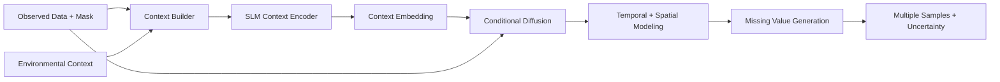

# Context-Aware Generative Imputation of Air Pollution Data
### SLM-Conditioned Diffusion for Spatio-Temporal Missing Data Imputation

An open research project developing a context-aware generative diffusion framework to reconstruct missing multi-modal air pollution observations. The methodology conditions spatio-temporal diffusion models on natural-language atmospheric and urban descriptors encoded by Small Language Models (SLMs).

---

## Overview

Air pollution monitoring networks frequently suffer from telemetry dropouts, sensor degradation, and maintenance outages, producing non-random missing observations that distort exposure modeling and environmental policy decisions. Existing imputation models rely either on deterministic regression—producing single-point estimates that lack uncertainty bounds—or unconditioned time-series generation that ignores macro-level atmospheric dynamics.

This project investigates **SLM-Conditioned Diffusion**: introducing a Small Language Model context encoder that translates co-located weather regimes, diurnal solar cycles, and traffic congestion patterns into continuous semantic embeddings. These embeddings condition a conditional Denoising Diffusion Probabilistic Model (DDPM) equipped with spatial graph priors and temporal self-attention, generating calibrated posterior distributions and physically plausible pollutant reconstructions under missingness rates ranging from 10% to 70%.

---

## Research Status

| Research Component | Current Status | Notes & Evidence |
| :--- | :---: | :--- |
| **Literature & CTDI Analysis** | **`Verified`** | Table I, Section III-A (IDW), and Section V-C of Yu et al. (IEEE TBD 2025) audited in [`research/literature/CTDI Paper Exhaustive Analysis.md`](research/Literature/CTDI%20Paper%20Exhaustive%20Analysis.md). |
| **Air-Quality Dataset** | **`Verified`** | 3-year continuous EPD records (420,864 rows, 16 stations, 0 negative values) validated in [`data/raw/air_quality/`](data/raw/air_quality/). |
| **Meteorology Dataset** | **`Partially Verified`** | Interim ERA5 reanalysis dataset loaded (420,864 rows); pending acquisition of HKO AWS visibility to replace rainfall. |
| **Traffic Dataset** | **`Blocked`** | Parent 1st Gen Speedmap verified across 607 links (774k snapshots); batch historical XML ingestion pending. |
| **13-Channel Alignment** | **`Blocked`** | Spatial Cartesian grid constructed; alignment script enforces a safety halt until real traffic is ingested. |
| **Context Builder** | **`In Progress`** | Deterministic atmospheric prompt builder prototype implemented in [`src/context/builder.py`](src/context/builder.py). |
| **SLM Context Encoder** | **`In Progress`** | Architecture designed for lightweight frozen/LoRA SLMs (Phi-3 / Gemma-2B / Llama-3.2-1B). |
| **Conditional Diffusion** | **`In Progress`** | DDPM formulation with AdaLN conditioning, temporal attention, and spatial graph prior specified. |
| **Model Training** | **`Not Started`** | Chronological 70/15/15 train/val/test split and composite loss functions formulated. |
| **Evaluation Suite** | **`Ready`** | MAE, RMSE, MAPE, CRPS, and 95% PICP metric functions implemented in [`src/evaluation/metrics.py`](src/evaluation/metrics.py). |

*Full operational dashboard and component blockers are maintained in [`research/research_status.md`](research/research_status.md).*

---

## Method



- **Context Builder**: Synthesizes structured natural-language prompts capturing barometric regimes, boundary-layer dispersion conditions, diurnal cycles, and corridor traffic states.
- **SLM Context Encoder**: Extracts dense semantic embeddings ($\mathbf{z}_C$) from atmospheric prompts using a lightweight Small Language Model.
- **Conditional Diffusion**: Guides a continuous reverse denoising diffusion process conditioned jointly on observed sensor floats and the semantic context vector.
- **Temporal & Spatial Modeling**: Decouples 24-hour sequence dynamics (via temporal self-attention) from inter-station correlations (via spatial distance graph convolutions).
- **Uncertainty-Aware Generation**: Draws ensemble posterior trajectories to evaluate point estimates (median MAE/RMSE) alongside calibrated prediction intervals (95% PICP) and continuous ranked probability scores (CRPS).

---

## Dataset

### Target Benchmark Structure (CTDI Specification)
Benchmarked directly against the Hong Kong experimental setting published in Yu et al. (*IEEE Transactions on Big Data*, 2025):
- **Domain**: Hong Kong Special Administrative Region
- **Temporal Coverage**: 2019-01-01 00:00:00 to 2021-12-31 23:00:00 (1,096 days = **26,304 hours**)
- **Spatial Anchors**: **16 air-quality monitoring stations** (Southern #84 and North #85 excluded for historical continuity)
- **Target Tensor Geometry**: $16 \text{ stations} \times 26,304 \text{ hours} \times 13 \text{ channels} = \mathbf{5,471,232} \text{ values}$ (**420,864 station-hour rows**)

### The 13 Benchmark Channels
- **Criteria Pollutants (5)**: $\text{PM}_{2.5}$, $\text{PM}_{10}$, $\text{NO}_2$, $\text{SO}_2$, $\text{O}_3$ ($\mu\text{g/m}^3$, 1-hour update)
- **Surface Meteorology (6)**: Pressure ($\text{hPa}$), Relative Humidity ($\%$), Temperature ($^\circ\text{C}$), Visibility ($\text{km}$), Wind Direction ($\text{N/A}$), Wind Speed ($\text{km/h}$)
- **Urban Traffic (2)**: Traffic Speed ($\text{km/h}$), Traffic Congestion / Road Saturation Level ($\text{N/A}$)

### Prepared State vs. Published Ground Truth
- **Air Quality**: Fully validated ($420,864$ rows, natural missingness $\approx 2.5\%\text{--}2.8\%$, zero negative values).
- **Meteorology**: Reanalysis table complete; source-fidelity update pending to ingest HKO AWS visibility in place of rainfall.
- **Traffic**: Parent 1st Gen Traffic Speed Map verified across 607 road links (774k archived XML snapshots); batch historical ingestion is pending. Synthetic traffic generation is strictly prohibited by pipeline safety assertions.

→ Detailed dataset documentation: [`research/dataset/CTDIDataset Specifications.md`](research/Dataset/CTDIDataset%20Specifications.md)

---

## Repository Structure

```text
.
├── src/            # Core package implementation
│   ├── context/    # Environmental context builder for SLM conditioning
│   ├── Dataset/    # Sliding window segmentation and missingness simulation
│   ├── evaluation/ # Imputation metrics (MAE, RMSE, MAPE, CRPS, PICP)
│   ├── models/     # Model architectures (SLM encoder and diffusion denoiser)
│   └── preprocessing/ # Ingestion, temporal grid alignment, and spatial IDW
├── configs/        # Pipeline parameters and normalization statistics
├── scripts/        # Data downloading, verification, and utility scripts
├── tests/          # Unit tests and tensor assertion suites
├── data/           # Raw archives, interim tables, and canonical tensors (gitignored)
├── research/       # Modular research knowledge base and evidence records
├── Reports/        # Archived investigation reports and historical logs
├── api.py          # FastAPI service entry point
├── requirements.txt # Python package dependencies
└── README.md       # Public repository entry point
```

*Detailed research documentation is maintained separately under [`research/`](research/).*

---

## Quick Start

### 1. Environment Setup
```bash
# Clone repository
git clone https://github.com/hrittik702/ctdi-model-project.git
cd ctdi-model-project

# Initialize and activate Python virtual environment
python3 -m venv .venv
source .venv/bin/activate

# Install dependencies
pip install -r requirements.txt
```

### 2. Verify Raw Datasets & Integrity Assertions
```bash
# Run automated dataset verification suite
python scripts/verify_raw_datasets.py

# Run standalone spatio-temporal alignment check (verifies traffic safety assertion)
python -c "from src.preprocessing.alignment import run_standalone_check; run_standalone_check()"
```

→ Preprocessing and pipeline execution guide: [`research/Preprocessing/`](research/Preprocessing/)

---

## Research Documentation

This repository enforces an evidence-backed documentation philosophy. High-level knowledge, experimental logs, and architectural choices are maintained modularly:

```text
research/
├── MASTER_RESEARCH_DOCUMENT.md
├── research_status.md
├── research_timeline.md
├── Literature/
├── Dataset/
├── Preprocessing/
├── Architecture/
├── Experiments/
├── Findings/
├── Decisions/
├── Reports/
└── checkpoints/
```

| Section | Core Focus & File Path |
| :--- | :--- |
| **Master Research Document** | Consolidated research thesis and scientific knowledge base: [`research/MASTER_RESEARCH_DOCUMENT.md`](research/MASTER_RESEARCH_DOCUMENT.md) |
| **Status Dashboard** | Live operational readiness and component blocker tracking: [`research/research_status.md`](research/research_status.md) |
| **Research Timeline** | Chronological record of milestones and paradigm shifts: [`research/research_timeline.md`](research/research_timeline.md) |
| **Dataset Specifications** | Tensor formulation, 13 channels, source fidelity, and station inventory: [`research/Dataset/`](research/Dataset/) |
| **Preprocessing Pipeline** | Spatial IDW ($p=2$), cleaning rules, and zero-leakage normalization: [`research/Preprocessing/`](research/Preprocessing/) |
| **Model Architecture** | SLM context builder, diffusion denoiser, and loss formulations: [`research/Architecture/`](research/Architecture/) |
| **Experimental Protocols** | Missingness benchmark scenarios (MCAR/block/outage) and baseline designs: [`research/Experiments/`](research/Experiments/) |
| **Scientific Findings** | Empirically confirmed findings and documented negative results (dead ends): [`research/Findings/`](research/Findings/) |
| **Decision Records (ADRs)** | Formal methodological and architectural decision logs: [`research/Decisions/`](research/Decisions/) |
| **Reports Archive** | Verbatim table reproductions and historical audits: [`research/Reports/`](research/Reports/) |
| **Daily Checkpoints** | Dated daily research logs and session freezes: [`research/Checkpoints/`](research/Checkpoints/) |

---

## Citation

```bibtex
@article{yu2025ctdi,
  title={CTDI: CNN-Transformer-Based Spatial-Temporal Missing Air Pollution Data Imputation},
  author={Yu, Yangwen and Li, Victor O. K. and Lam, Jacqueline C. K. and Chan, Kelvin and Zhang, Qi},
  journal={IEEE Transactions on Big Data},
  volume={11},
  number={5},
  pages={2442--2455},
  year={2025},
  doi={10.1109/TBDATA.2025.3533882}
}
```

Published Paper DOI: [10.1109/TBDATA.2025.3533882](https://doi.org/10.1109/TBDATA.2025.3533882)
