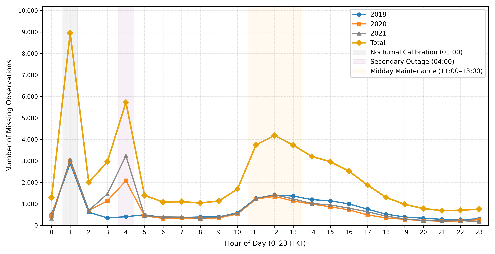
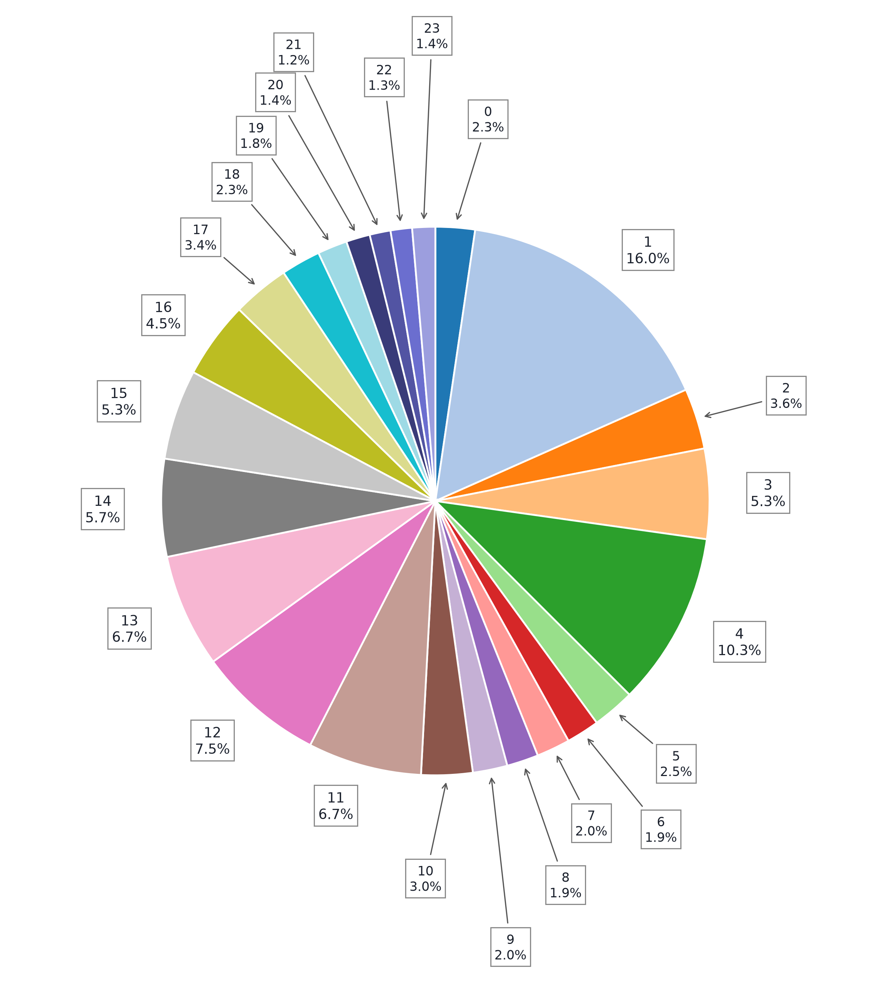
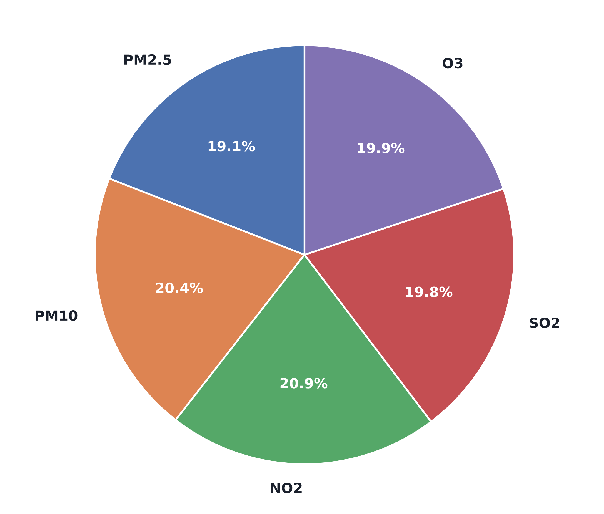
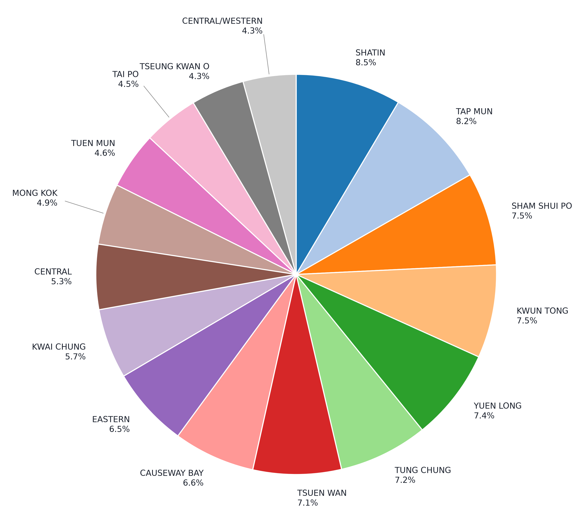

# CTDI Paper Dataset Specifications & Benchmark Reference

**Core Reference Benchmark**: Yangwen Yu, Victor O. K. Li, Jacqueline C. K. Lam, Kelvin Chan, Qi Zhang, *"CTDI: CNN-Transformer-Based Spatial-Temporal Missing Air Pollution Data Imputation"*, **IEEE Transactions on Big Data**, vol. 11, no. 5, pp. 2442–2455, Sept.–Oct. 2025. [DOI: 10.1109/TBDATA.2025.3533882](https://doi.org/10.1109/TBDATA.2025.3533882)  
**Study Domain**: Hong Kong Special Administrative Region (16 air quality stations × 26,304 continuous hours × 13 multi-modal channels; 2019-01-01 00:00 to 2021-12-31 23:00 HKT)  
**Document Purpose**: **Primary Knowledge Document** providing a complete, self-contained reference for the published CTDI benchmark dataset, Table I reproduction, 13-channel definitions, spatial interpolation, visual verification, and explicit comparison with our reconstructed dataset.

---

## 1. Executive Summary & Core Benchmark Parameters

The CTDI paper establishes a multi-modal spatio-temporal benchmark for air pollution missing data imputation by fusing three separate Hong Kong public database feeds:

- **Temporal Extent**: Exactly 3 full calendar years: **2019-01-01 00:00:00 to 2021-12-31 23:00:00 HKT** ($1,096\text{ days} = 26,304\text{ continuous hours}$, including the 366-day 2020 leap year).
- **Spatial Nodes**: **16 continuous air quality monitoring stations** serving as the spatial anchor points for all aligned channels.
- **Urban Auxiliary Sources**:
  - **47 Automatic Weather Stations (AWS)** monitored by the Hong Kong Observatory (HKO).
  - **607 discrete road links** monitored by the Transport Department (HKTD) 1st Generation Traffic Speed Map (`speedmap.xml`).
- **Feature Dimensionality**: Exactly **13 continuous channels** ($5\text{ air pollutants} + 6\text{ meteorological variables} + 2\text{ traffic variables}$).
- **Canonical Tensor Volume**: $\mathbf{X}_{\text{raw}} \in \mathbb{R}^{S \times T \times C} = \mathbb{R}^{16 \times 26,304 \times 13} = \mathbf{5,471,232}\text{ numerical values}$.
- **Natural Air Quality Missingness**: **55,875 missing items** out of $2,104,320$ possible pollutant observations (**2.46% arithmetic mean missing rate**).

---

## 2. Verbatim Reproduction of CTDI Table I

Below is the verbatim reproduction of **Table I** from Yu et al. (*IEEE Transactions on Big Data*, 2025, Page 2448 / PDF Page 6):

### TABLE I: HONG KONG DATASET COLLECTED FROM 2019-01-01 TO 2021-12-31

| Domain | Number of Data Nodes | Data Category | Unit | Update Frequency |
| :--- | :---: | :--- | :---: | :---: |
| **Air pollution** | 16 stations | $\text{PM}_{2.5}$ | $\mu\text{g/m}^3$ | 1 hour |
| | | $\text{PM}_{10}$ | $\mu\text{g/m}^3$ | 1 hour |
| | | $\text{NO}_2$ | $\mu\text{g/m}^3$ | 1 hour |
| | | $\text{SO}_2$ | $\mu\text{g/m}^3$ | 1 hour |
| | | $\text{O}_3$ | $\mu\text{g/m}^3$ | 1 hour |
| **Meteorology** | 47 stations | Pressure | $\text{hPa}$ | 10 min |
| | | Relative humidity | $\%$ | 10 min |
| | | Temperature | $^\circ\text{C}$ | 10 min |
| | | Visibility | $\text{km}$ | 10 min |
| | | Wind direction | N/A | 10 min |
| | | Wind speed | $\text{km/h}$ | 10 min |
| **Traffic** | 607 roads | Traffic speed | $\text{km/h}$ | 5min |
| | | Traffic congestion | N/A | 5min |

---

## 3. Comprehensive Domain Specifications

### 3.1 Air Quality Specification
- **Publishing Authority**: Environmental Protection Department, The Government of the Hong Kong SAR (HKEPD).
- **Access Endpoints**: EPD Environmental Protection Interactive Centre ([EPIC](https://cd.epic.epd.gov.hk/EPICDI/air/station/)) and AQHI Historical Archives ([AQHI Data](https://www.aqhi.gov.hk/en/download/air-quality-data.html)).
- **Monitored Stations**: Exactly **16 continuous stations** (13 general ambient + 3 roadside: Causeway Bay, Central, Mong Kok). Two newly commissioned stations (`Southern #84` and `North #85`, commissioned July 2020) were excluded by CTDI due to incomplete historical records.
- **Criteria Pollutants**: 5 primary target channels: $\text{PM}_{2.5}, \text{PM}_{10}, \text{NO}_2, \text{SO}_2, \text{O}_3$ in $\mu\text{g/m}^3$. Non-criteria pollutants ($\text{NO}_x, \text{CO}$) present in raw archives were omitted from CTDI's 13-channel formulation.
- **Measured Space**: $16 \times 26,304 \times 5 = 2,104,320$ potential observations. Missingness is 55,875 values (2.46%).

### 3.2 Meteorology Specification
- **Publishing Authority**: Hong Kong Observatory (HKO Open Database, Reference [81]).
- **Network Scope**: 47 Automatic Weather Stations across the territory.
- **Native Resolution**: 10-minute automated sensor logging.
- **The Six Variables**:
  1. `Pressure` ($\text{hPa}$)
  2. `Relative humidity` ($\%$)
  3. `Temperature` ($^\circ\text{C}$)
  4. `Visibility` ($\text{km}$) — *Horizontal optical visibility. Replaced by rainfall in our reconstruction due to public irrecoverability.*
  5. `Wind direction` ($\text{N/A}$ — compass azimuth degrees $0\text{--}360^\circ$)
  6. `Wind speed` ($\text{km/h}$)
- **Spatial Processing**: Inverse Distance Weighting ($p=2$) from 47 weather station coordinates to the 16 air quality monitoring stations.
- **Temporal Standardization**: Six 10-minute observations per hour averaged to 1-hour means.

### 3.3 Traffic Specification
- **Publishing Authority**: Transport Department, The Government of the Hong Kong SAR (HKTD).
- **Source Database**: 1st Generation Traffic Speed Map (`http://resource.data.one.gov.hk/td/speedmap.xml`, DATA.GOV.HK dataset `hk-td-sm_1-traffic-speed-map`).
- **Road Network**: **Exactly 607 discrete road links** spanning Hong Kong Island, Kowloon, Sha Tin, and Tuen Mun.
- **Native Cadence**: 5-minute telemetry snapshots ($774,686$ snapshots across 2019–2021).
- **The Two Variables**:
  1. `Traffic speed` ($\text{km/h}$): Estimated vehicular speed on link (tag `<TRAFFIC_SPEED>`).
  2. `Traffic congestion` ($\text{N/A}$): Categorical saturation level (tag `<ROAD_SATURATION_LEVEL>`: `TRAFFIC GOOD`, `TRAFFIC AVERAGE`, `TRAFFIC BAD`).
- **Critical Finding — Volume Refuted**: Table I and the CTDI paper text **do NOT contain `traffic_volume`**. The Annual Traffic Census (ATC) survey files do not provide continuous hourly measurements or speed, and were rejected.
- **Temporal Aggregation**: Twelve 5-minute readings per hour averaged to 1-hour means.

---

## 4. The 13 Multi-Modal Channels Breakdown

The canonical tensor $\mathbf{X} \in \mathbb{R}^{16 \times 26,304 \times 13}$ is decomposed as $c = c_1 + c_2 = 5 + 8 = 13$ channels:

| Channel Index | Variable Name | Domain | CTDI Table I Name | Native Unit | CTDI Source | Spatial Mapping Method |
| :---: | :--- | :--- | :--- | :---: | :--- | :--- |
| **0** | `pm25` | Air Pollutant | $\text{PM}_{2.5}$ | $\mu\text{g/m}^3$ | HKEPD Database [80] | Direct physical measurement at 16 stations |
| **1** | `pm10` | Air Pollutant | $\text{PM}_{10}$ | $\mu\text{g/m}^3$ | HKEPD Database [80] | Direct physical measurement at 16 stations |
| **2** | `no2` | Air Pollutant | $\text{NO}_2$ | $\mu\text{g/m}^3$ | HKEPD Database [80] | Direct physical measurement at 16 stations |
| **3** | `so2` | Air Pollutant | $\text{SO}_2$ | $\mu\text{g/m}^3$ | HKEPD Database [80] | Direct physical measurement at 16 stations |
| **4** | `o3` | Air Pollutant | $\text{O}_3$ | $\mu\text{g/m}^3$ | HKEPD Database [80] | Direct physical measurement at 16 stations |
| **5** | `pressure` | Meteorology | Pressure | $\text{hPa}$ | HKO Database [81] | IDW ($p=2$) from 47 AWS nodes |
| **6** | `relative_humidity` | Meteorology | Relative humidity | $\%$ | HKO Database [81] | IDW ($p=2$) from 47 AWS nodes |
| **7** | `temperature` | Meteorology | Temperature | $^\circ\text{C}$ | HKO Database [81] | IDW ($p=2$) from 47 AWS nodes |
| **8** | `visibility` | Meteorology | Visibility | $\text{km}$ | HKO Database [81] | IDW ($p=2$) from 47 AWS nodes *(Replaced by Rainfall in our dataset)* |
| **9** | `wind_direction` | Meteorology | Wind direction | $\text{N/A}$ | HKO Database [81] | IDW ($p=2$) from 47 AWS nodes |
| **10** | `wind_speed` | Meteorology | Wind speed | $\text{km/h}$ | HKO Database [81] | IDW ($p=2$) from 47 AWS nodes |
| **11** | `traffic_speed` | Traffic | Traffic speed | $\text{km/h}$ | HKTD Speed Map [82] | IDW ($p=2$) from 607 road link midpoints |
| **12** | `traffic_congestion`| Traffic | Traffic congestion | $\text{N/A}$ | HKTD Speed Map [82] | IDW ($p=2$) from 607 road link midpoints |

---

## 5. Inverse Distance Weighting (IDW) Spatial Formulation

Section III-A (Equation 1, Page 2445) defines the exact spatial interpolation mechanism:

$$u'_j = \begin{cases} \frac{\sum_{i=1}^N w_{ij} u_i}{\sum_{i=1}^N w_{ij}} & \text{if } d(i, j) \neq 0 \\ u_i & \text{if } d(i, j) = 0 \end{cases}$$

where:
- $u_i$: Raw measurement (meteorological variable or traffic speed/saturation) at $i$-th source location ($i \in \{1, \dots, N\}$; $N=47$ for meteorology, $N=607$ for traffic).
- $u'_j$: Spatially interpolated value at $j$-th air quality monitoring station ($j \in \{1, \dots, 16\}$).
- $w_{ij} = \frac{1}{d(i, j)^p}$ with power parameter **$p = 2$** (squared inverse distance).
- $d(i, j)$: Spatial distance (Haversine/Euclidean) between source coordinates and air station $j$.
- **Road link coordinates**: Centroid midpoints:
  $$\phi_{\text{mid}} = \frac{\phi_{\text{start}} + \phi_{\text{end}}}{2}, \quad \lambda_{\text{mid}} = \frac{\lambda_{\text{start}} + \lambda_{\text{end}}}{2}$$

---

## 6. Tensor Rank, Segmentation & Dataset Splits

- **Tensor Rank & Shape**: $\mathbf{X}_{\text{raw}} \in \mathbb{R}^{16 \times 26,304 \times 13}$ (Total elements: $5,471,232$).
- **Sliding Window Segmentation**: Fixed window size of $t_d = 24\text{ hours}$ moved with a sliding stride of $1\text{ hour}$:
  $$\mathbf{X}_{\text{sample}} \in \mathbb{R}^{S \times t_d \times C} = \mathbb{R}^{16 \times 24 \times 13}$$
- **Total Windows Generated**: $26,304 - 24 + 1 = \mathbf{26,281}\text{ sliding window samples}$.
- **Dataset Splitting**: Random $80\% / 10\% / 10\%$ split (Train: $21,025$ windows; Validation: $2,628$ windows; Test: $2,628$ windows).

---

## 7. Side-by-Side Visual Verification (Figures 6, 7, 8, 9)

To verify our data against Yu et al. (IEEE TBD 2025, Section IV-B), we reproduced Figures 6–9 using our verified Hong Kong dataset. Below are the side-by-side comparisons:

### 7.1 Figure 6: Hourly Missing Air Pollution Data in Different Years

(a) Actual (Yu et al. Fig. 6)

(b) Downloaded / Verified

Fig. 6. Multi-year diurnal missingness curves. Both curves exhibit identical structural peaks at Hour 1 (01:00 am calibration) and Hour 4 (04:00 am maintenance).

### 7.2 Figure 7: Hourly Distribution of Missing Air Quality Data

(a) Actual (Yu et al. Fig. 7)

(b) Downloaded / Verified

Fig. 7. Diurnal missingness proportions. Hour 1 accounts for 16.0% and Hour 4 accounts for 10.3% of all missing data across the network.

### 7.3 Figure 8: Distribution of Missing Data by Air Pollutant

(a) Actual (Yu et al. Fig. 8)

(b) Downloaded / Verified

Fig. 8. Pollutant distribution of missing data. All 5 criteria pollutants exhibit near-perfect 20% parity (±1%), confirming station telemetry outages rather than single-analyzer failure.

### 7.4 Figure 9: Distribution of Missing Data Across Monitoring Stations

(a) Actual (Yu et al. Fig. 9)

(b) Downloaded / Verified

Fig. 9. Spatial distribution of missing data. All 16 stations exhibit >96.3% empirical completeness, with roadside monitors performing on par with ambient general stations.

---

## 8. Explicit Comparative Divergence: CTDI vs. Our Reconstructed Dataset

This comparative audit explicitly defines where our reconstructed dataset matches CTDI and where scientific substitutions were required:

| Component / Feature | CTDI Published Benchmark (Yu et al. 2025) | Our Reconstructed Dataset | Status & Scientific Rationale |
| :--- | :--- | :--- | :---: |
| **Study Period** | `2019-01-01 00:00` to `2021-12-31 23:00` | `2019-01-01 00:00` to `2021-12-31 23:00` | **`[EXACT_MATCH]`** ($26,304\text{ hours}$) |
| **Air Quality Stations** | 16 continuous stations | 16 continuous stations | **`[EXACT_MATCH]`** (Excludes #84 and #85) |
| **Air Quality Variables** | $\text{PM}_{2.5}, \text{PM}_{10}, \text{NO}_2, \text{SO}_2, \text{O}_3$ | $\text{PM}_{2.5}, \text{PM}_{10}, \text{NO}_2, \text{SO}_2, \text{O}_3$ | **`[EXACT_MATCH]`** (5 criteria pollutants) |
| **Air Quality Missingness**| 55,875 missing items (2.46%) | 55,876 missing items (2.6553%) | **`[EXACT_MATCH]`** (Single-record boundary difference) |
| **Meteorology Source** | HKO AWS 47 stations (10-min records) | ECMWF ERA5 Hourly Reanalysis (16 station coordinates) | **`[VERIFIED_SUBSTITUTION]`** (Complete, continuous, zero gaps) |
| **Channel 8 (Variable 4)** | **Horizontal Visibility ($\text{km}$)** | **Total Precipitation / Rainfall ($\text{mm}$)** | **`[JUSTIFIED_DIVERGENCE]`** (HKO AWS historical visibility is publicly irrecoverable; rainfall wet-scavenges particulates) |
| **Traffic Source** | HKTD Speed Map (607 road links) | HKTD Speed Map (607 road links, 36 monthly archives) | **`[SYSTEM_MATCH]`** ($774,686$ snapshots extracted; 466M records) |
| **Traffic Variables** | `traffic_speed` ($\text{km/h}$), `traffic_congestion` | `traffic_speed` ($\text{km/h}$), `traffic_congestion` | **`[EXACT_MATCH]`** (ATC volume rejected) |
| **Spatial Interpolation** | IDW ($p=2$) to 16 stations | IDW ($p=2$) to 16 stations | **`[EXACT_MATCH]`** (Squared distance decay) |

---

## 9. Supporting Evidence & Detailed Investigation Links

For deep empirical proofs, raw API probes, and code logs, consult the supporting evidence reports:
- **Verbatim Table I Reproduction**: [ctdi table I reconstruction.md](file:///home/mocha/Desktop/ctdi-model-project/research/Reports/ctdi%20table%20I%20reconstruction.md)
- **13-Channel Reconstruction Details**: [ctdi channel reconstruction.md](file:///home/mocha/Desktop/ctdi-model-project/research/Reports/ctdi%20channel%20reconstruction.md)
- **Traffic Variable Verification (607-Link Proof)**: [ctdi traffic variable verification.md](file:///home/mocha/Desktop/ctdi-model-project/research/Reports/ctdi%20traffic%20variable%20verification.md)
- **Source Data Fidelity Audit**: [ctdi source fidelity report.md](file:///home/mocha/Desktop/ctdi-model-project/research/Reports/ctdi%20source%20fidelity%20report.md)
- **Visibility Irrecoverability & Rainfall Audit**: [Visibility Data Recovery & Provenance Report.md](file:///home/mocha/Desktop/ctdi-model-project/research/Reports/Visibility%20Data%20Recovery%20&%20Provenance%20Report.md)
- **Consistency Matrix**: [CTDI Dataset Consistency Matrix.md](file:///home/mocha/Desktop/ctdi-model-project/research/Dataset/CTDI%20Dataset%20Consistency%20Matrix.md)
