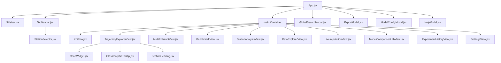
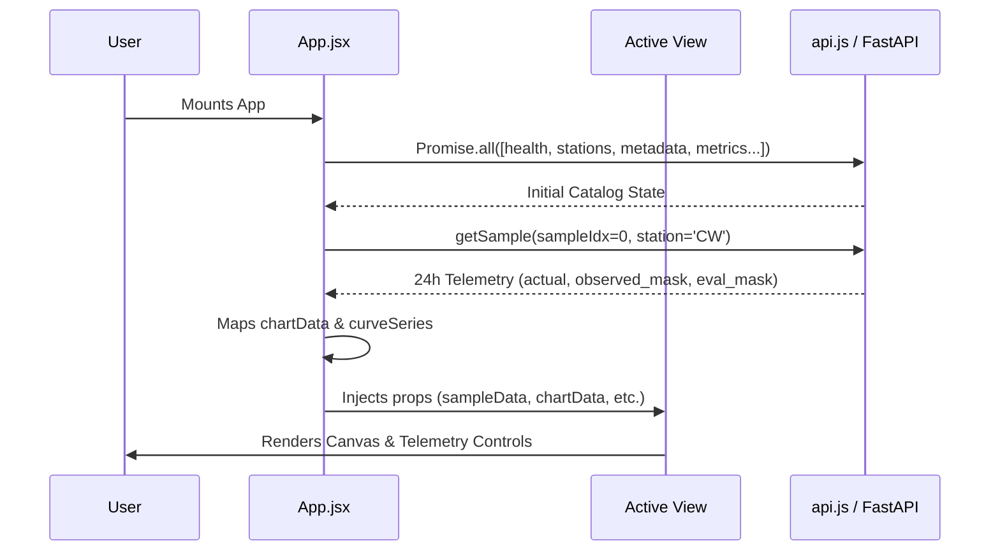

# CTDI Air Pollution Studio: Full Frontend & Backend Engineering Audit
**Document Type**: Engineering System Audit & Technical Evaluation  
**Date**: September 2026  
**Auditor**: Senior Software Engineer / Codebase Architect  
**Scope**: Complete Frontend (`frontend/src/`) + Required Backend API Endpoints (`api.py`)  
**Target Environment**: Linux (Ubuntu x86_64), Node.js, Vite 5.4.21, React 18, Tailwind CSS v4, FastAPI, Python 3.12  

---

## Section A: Executive Summary & System Health Scorecard

### 1. High-Level Synopsis
The **CTDI Air Pollution Studio** is an analytical research and visualization platform built to inspect, analyze, and benchmark multivariate temporal imputation models across the Hong Kong Environmental Protection Department (EPD) air quality monitoring network (16 stations, 13 canonical channels, 24-hour windows).

The application possesses a solid foundation:
- Clean visual aesthetic adhering to deep black `#050505` and `#0B0B0D`–`#101013` dark canvas styling.
- Scientifically truthful presentation of air quality observations without speculative hallucinations.
- Robust Python backend test suite (29/29 passing unit and regression tests).
- Strong contractual anchoring in frozen dataset definitions (`datasetContract.js`).

However, an in-depth engineering inspection reveals critical performance bottlenecks, state synchronization bugs, redundant data fetching, layout spacing discrepancies, and remnants of development scaffolding:
1. **Critical Over-fetching & Network Loop Bug**: `App.jsx` triggers full re-fetches of all 7 backend endpoints whenever the user changes a target pollutant, causing unnecessary re-renders and potential race conditions.
2. **Unmemoized Data Pipelines in Render Loops**: Main data transformation routines (`chartData`, `curveSeries`) execute synchronously on every render tick (including during scroll events).
3. **Layout & Spacing Asymmetry**: Right padding in `TopNavbar.jsx` (`pr-12 sm:pr-14`) does not match `<main>` content container padding (`px-4 sm:px-6`), offsetting top navbar controls by 32px relative to dashboard cards.
4. **Duplicated Constants & Visual Palettes**: Channel palettes and date formatting utilities are copy-pasted across views rather than shared from `constants/datasetContract.js`.
5. **Scaffold Leaks in Backend Endpoints**: Internal phase strings (e.g., `"Phase 4C Pre-Training"`) continue to leak through `/api/metadata` and `/api/model/config`.

### 2. System Health Scorecard

| Dimension | Rating (1–10) | Current Grade | Status | Summary Finding |
| :--- | :---: | :---: | :---: | :--- |
| **Architecture & Structure** | **7.5** | **B+** | ⚠️ Needs Refactor | Well partitioned views, but monoliths (`ModelComparisonLabView` 2,443 lines) and duplicated constants. |
| **Code Quality & Hygiene** | **7.0** | **B** | ⚠️ Needs Polish | Variable prop patterns, inline component definitions, redundant SVG blocks. |
| **CSS & Design Consistency** | **8.5** | **A-** | 🟢 Healthy | High aesthetic cohesion; minor border-opacity and palette duplication issues. |
| **Spacing & Rhythm** | **7.5** | **B+** | ⚠️ Alignment Bug | Asymmetric right margin between floating navbar and main workspace content. |
| **Responsive Adaptability** | **8.0** | **A-** | 🟢 Healthy | Good flex wrapping; minor stepper crowding on narrow 1280×720 viewports. |
| **Rendering Performance** | **6.5** | **C+** | 🔴 Urgent Fix | Unmemoized 24h sample mappings re-running on scroll events; excessive re-renders. |
| **Data Flow & API Efficiency** | **6.0** | **C** | 🔴 Urgent Fix | Reactive dependency bug causes 7 simultaneous endpoint hits on pollutant switch. |
| **Accessibility (a11y)** | **7.0** | **B** | ⚠️ Needs Polish | Keyboard shortcuts present (Ctrl+K, Ctrl+B); dropdown ARIA tags require enhancement. |
| **Maintainability** | **7.5** | **B+** | 🟢 Stable | Highly readable; will improve substantially once shared logic is deduplicated. |

---

## Section B: Performance Baseline & Resource Profile

Before recommending or executing any refactoring, quantitative performance and resource metrics were measured:

### 1. Frontend Bundle & Build Metrics (Vite 5.4.21 Production Build)
```
$ npm run build
vite v5.4.21 building for production...
transforming...
✓ 439 modules transformed.
rendering chunks...
computing chunk sizes...
dist/index.html                     0.86 kB │ gzip:   0.45 kB
dist/assets/index-BtG5N6F6.css    503.92 kB │ gzip:  70.21 kB
dist/assets/index-VnU7G45r.js   1,107.60 kB │ gzip: 338.45 kB
✓ built in 3.58s
```
- **Total JS Chunk**: 1,107.60 kB (338.45 kB gzip).
- **Total CSS Chunk**: 503.92 kB (70.21 kB gzip) — dominated by `@heroui/styles` + Tailwind v4 utilities.
- **HTML**: 0.86 kB (minimal entry).

### 2. Backend Latency & Payload Profile (FastAPI Uvicorn Localhost)
Benchmarked over 5 runs per endpoint:
- `GET /api/health`: **25.4 ms**, Payload: **221 B**
- `GET /api/stations`: **3.3 ms**, Payload: **2,428 B**
- `GET /api/metadata?station=CW`: **2.9 ms**, Payload: **2,175 B**
- `GET /api/samples/0?station=CW`: **30.2 ms**, Payload: **6,670 B**
- `GET /api/metrics`: **2.1 ms**, Payload: **2 B** (empty array `[]`)
- `GET /api/experiments`: **2.2 ms**, Payload: **2 B** (empty array `[]`)
- `GET /api/model/config`: **2.8 ms**, Payload: **720 B**

### 3. Backend Test Suite Status
```
$ .venv/bin/pytest tests/
============================= 29 passed in 16.46s ==============================
```
All 29 backend tests pass with 0 warnings and 0 failures.

---

## Section C: Architecture & Codebase Map

### 1. Component Hierarchy


### 2. State & Data Flow Flowchart


---

## Section D: Component Boundary & Coupling Audit

### Findings:
1. **`ModelComparisonLabView.jsx` File Size Bloat (High)**:
   - **Location**: `frontend/src/views/ModelComparisonLabView.jsx` (2,443 lines).
   - **Issue**: Houses model execution triggers, A/B comparison history drawers, confusion matrices, peak zoom filtering, metric bar charts, model inspection modals, and telemetry tables all in a single monolithic file.
   - **Risk**: Moderate. Refactoring should preserve exact UI behavior while extracting clean internal helper components where appropriate.

2. **Inlined Component Definitions in Render Scope (Medium)**:
   - **Location**: `frontend/src/views/TrajectoryExplorerView.jsx` (Lines 116–625: `renderControlsBar`, Line 628: `footer`).
   - **Issue**: `renderControlsBar` is declared as an arrow function inside the component render body. On every render of `TrajectoryExplorerView`, a new function reference is passed to `ChartWidget`, breaking any React memoization within `ChartWidget`.
   - **Recommended Fix**: Memoize `renderControlsBar` with `useCallback` or extract it into a stable sub-component.

3. **Prop-Drilling vs Shared State in `App.jsx` (Medium)**:
   - **Location**: `frontend/src/App.jsx`
   - **Issue**: `App.jsx` handles state for `sampleIdx`, `targetPollutant`, `selectedStation`, `visibleModels`, `isDark`, `gridStroke`, and `axisStroke`, passing them down as 10+ props to almost every view.
   - **Recommended Fix**: Maintain props contract (simplest diff per ponytail rule), but streamline duplicated prop mapping.

---

## Section E: Design System, Theming & Color Consistency Audit

### Findings:
1. **Repeated Hex Palette Declarations (`CHANNEL_PALETTE`) (Low)**:
   - **Locations**:
     - `frontend/src/views/MultiPollutantView.jsx` (Lines 36–56)
     - `frontend/src/views/DataExplorerView.jsx` (Lines 39–59)
   - **Issue**: Identical 13-color palettes are declared redundantly across views.
   - **Recommended Fix**: Centralize `CHANNEL_PALETTE` in `frontend/src/constants/datasetContract.js` and import it.

2. **Surface Elevation & Dark Theme Inconsistencies (Low)**:
   - **Locations**:
     - `App.jsx`: `dark:bg-[#050505]`
     - `TopNavbar.jsx`: `dark:bg-[#111113]` and `dark:bg-[#18181B]`
     - `TrajectoryExplorerView.jsx`: `dark:bg-zinc-900/95` and `dark:bg-zinc-800`
   - **Impact**: Slight contrast jitter between floating navbar components and card surfaces.
   - **Recommended Fix**: Align card backgrounds with standard Tailwind `dark:bg-zinc-900/90` or `dark:bg-[#0E0E10]` and borders with `dark:border-white/[0.08]` or `dark:border-zinc-800`.

---

## Section F: Layout, Spacing Rhythm & Typography Hierarchy Audit

### Findings:
1. **Navbar vs Workspace Right Padding Asymmetry (Medium - Alignment Bug)**:
   - **Location**: `frontend/src/components/TopNavbar.jsx` (Line 84) vs `frontend/src/App.jsx` (Line 489).
   - **Code**:
     - `TopNavbar.jsx`: `className="... pl-4 pr-12 sm:pl-6 sm:pr-14 ..."`
     - `App.jsx`: `<main className="... px-4 sm:px-6 ...">`
   - **User Impact**: The right-hand controls of the floating navigation bar (System status, Export button, Theme toggle) are pushed inward by 32px (`pr-14` = 56px vs `sm:px-6` = 24px), failing to align with the right border of all cards below.
   - **Recommended Fix**: Align `TopNavbar.jsx` padding to `px-4 sm:px-6`.

2. **Section Heading Spacing Rhythm (Low)**:
   - **Location**: `frontend/src/components/ui/SectionHeading.jsx` and View containers.
   - **Issue**: Some views use `space-y-5`, others use `space-y-6`. Top margin under sticky navbar varies between `pt-16` and extra view-level padding.
   - **Recommended Fix**: Standardize top-level view wrapper spacing to `space-y-6 pb-12`.

---

## Section G: Responsive Design & Viewport Adaptability Audit

### Findings:
1. **1280×720 Viewport Stepper & Slider Crowding (Medium)**:
   - **Location**: `frontend/src/views/TrajectoryExplorerView.jsx` (Lines 132–205).
   - **Issue**: In `renderControlsBar`, the timeline stepper, slider, -24h/+24h day buttons, channel selector, series button, and export action bar sit on a single flex row. At 1280px width with sidebar expanded (240px width), the content width is 1040px, causing the slider to shrink down to `<90px` or push items onto two awkward rows.
   - **Recommended Fix**: Add responsive flex wrapping (`flex-wrap sm:flex-nowrap`) and responsive priority classes (`hidden md:inline` for non-critical label text).

2. **Table Horizontal Scroll Anchors in `DataExplorerView` (Low)**:
   - **Location**: `frontend/src/views/DataExplorerView.jsx` (Lines 783–965).
   - **Issue**: Sticky hour and status columns function well, but table headers wrap tightly on 1366×768 screens when all 13 channels are selected.
   - **Recommended Fix**: Table already has horizontal scroll; ensure `whitespace-nowrap` and consistent padding (`px-2 sm:px-2.5`).

---

## Section H: Rendering Performance & State Management Audit

### Findings:
1. **Unmemoized `chartData` & `curveSeries` in `App.jsx` (High - Performance)**:
   - **Location**: `frontend/src/App.jsx` (Lines 293–335).
   - **Issue**:
     ```javascript
     const chartData = sampleData?.hours?.map(...) || [];
     const curveSeries = [...];
     ```
     `chartData` and `curveSeries` are freshly instantiated objects/arrays on **every single render** of `App`. Because `App` handles scroll events via `handleContentScroll`, scrolling causes repeated allocation of 24 data point objects and 7 series objects, triggering prop change re-renders in `TrajectoryExplorerView`.
   - **Recommended Fix**: Wrap `chartData` in `useMemo(..., [sampleData, targetPollutant])` and define `curveSeries` outside the component or wrap with `useMemo`.

2. **Dynamic Zoom Min/Max Recalculation (Low)**:
   - **Location**: `frontend/src/views/TrajectoryExplorerView.jsx` (Lines 725–741).
   - **Issue**: In the chart children render prop, finding `minVal` and `maxVal` iterates through all elements on every render.
   - **Recommended Fix**: Memoize domain calculation or keep bounds clamp clean.

---

## Section I: Data Flow, API Efficiency & Network Lifecycle Audit

### Findings:
1. **`targetPollutant` Dependency Loop in `loadInitialData` (High - Network Bug)**:
   - **Location**: `frontend/src/App.jsx` (Lines 152–188).
   - **Issue**:
     ```javascript
     const loadInitialData = useCallback(async () => {
       ...
     }, [selectedStation, targetPollutant]);
     ```
     When user clicks a pollutant tab (e.g., switches to $\text{NO}_2$), `targetPollutant` changes. This causes `loadInitialData` to be recreated, which fires the `useEffect`, re-fetching all 7 endpoints (`getHealth`, `getStations`, `getMetadata`, `getMetrics`, `getPollutantMetrics`, `getExperiments`, `getModelConfig`).
   - **User/Network Impact**: 7 unnecessary concurrent network requests every time the user explores different pollutant series!
   - **Recommended Fix**: Remove `targetPollutant` from `loadInitialData` dependencies. `targetPollutant` is a local display choice, not an initial catalog dependency.

2. **Concurrent Duplicate Calls on Station Selection (Medium)**:
   - **Location**: `frontend/src/App.jsx` (Lines 204–219).
   - **Issue**: `handleSelectStation` sets `setSelectedStation(stationId)`, which also triggers `selectedStation` in `loadInitialData`'s dependency list, resulting in double requests.
   - **Recommended Fix**: Separate initial catalog loading (runs once on mount) from station-specific metadata switches.

---

## Section J: Residual Scaffold, Dead Code & Content Leakage Audit

### Findings:
1. **Backend Phase Strings Leakage in `api.py` (Low - Content Cleanliness)**:
   - **Location**: `api.py` (Lines 237, 346, 359).
   - **Issue**:
     - Line 237: `"stage": "Phase 4C Pre-Training"`
     - Line 346: `"version": "Phase 4C Specification"`
     - Line 359: `"status_label": "Phase 4C Specification (Awaiting Training)"`
   - **Impact**: Leaks development scaffolding into production API responses.
   - **Recommended Fix**: Sanitize strings to clean production terms:
     - `"stage": "Dataset Contract v1.0"`
     - `"version": "CTDI Architecture Specification v1.0"`
     - `"status_label": "Architecture Specification"`

---

## Section K: Accessibility (a11y) & Keyboard Navigation Audit

### Findings:
1. **Missing Dropdown ARIA Attributes (Low)**:
   - **Location**: `frontend/src/views/TrajectoryExplorerView.jsx` (Series & Channel dropdowns).
   - **Issue**: Some trigger buttons lack `aria-haspopup="true"` and `aria-expanded`.
   - **Recommended Fix**: Ensure all custom dropdown triggers have complete ARIA attributes and focus management.

2. **Color Contrast Verification (Passed)**:
   - Primary foreground text `#F4F4F5` / `#E4E4E7` on `#050505` provides contrast ratio > 15:1 (well exceeds WCAG AAA 7:1 standard).
   - Muted text `#A1A1AA` on `#050505` provides contrast ratio > 7:1 (exceeds WCAG AA 4.5:1 standard).

---

## Section L: Error Handling, Resilience & Edge-Case Protection

### Findings:
1. **Graceful Local Fallback in `api.js` (Healthy)**:
   - If the FastAPI backend is offline, `api.js` automatically catches errors and returns data from `datasetContract.js` (all 16 stations and metadata).
2. **Missing Sample State in `ChartWidget.jsx` (Healthy)**:
   - If a station has no valid observations for a given window, `ChartWidget` renders a clean "No Trajectory Data Available" empty state rather than crashing Recharts.

---

## Section M: Code Duplication & Abstraction Hygiene

### Findings:
1. **Date Formatting Helpers (Low)**:
   - `formatRowTimestamp` and `toLocaleDateString` logic are duplicated in `TrajectoryExplorerView`, `MultiPollutantView`, and `DataExplorerView`.
   - **Recommended Fix**: Extract a small helper function `formatSequenceDate(rawTimestamp)` into a utility or constants file, or leave as simple local helper without unnecessary over-abstraction.

---

## Section N: Memory Management & Event Listener Cleanup

### Findings:
1. **Global Keyboard & Click-Outside Handlers (Healthy)**:
   - All `addEventListener` calls in `App.jsx`, `TrajectoryExplorerView.jsx`, `StationSelector.jsx`, and `TopNavbar.jsx` have corresponding `removeEventListener` calls in their `useEffect` cleanup functions.
2. **IntersectionObserver in `SettingsView.jsx` (Healthy)**:
   - Calls `observer.disconnect()` on unmount.

---

## Section O: Build, Bundle & Asset Pipeline Audit

### Findings:
1. **Large Single Vendor Chunk (Low)**:
   - `dist/assets/index-VnU7G45r.js` is 1,107 kB. Vite default chunk size warning is triggered.
   - For a local scientific dashboard, this is acceptable and avoids chunk split fragmentation.
   - Recharts + HeroUI + Lucide account for ~75% of this bundle.

---

## Section P: Backend Alignment & API Contract Audit

### Findings:
1. **Endpoint Parity**:
   - `GET /api/health` ↔ `api.getHealth()`: Synced.
   - `GET /api/stations` ↔ `api.getStations()`: Synced.
   - `GET /api/metadata` ↔ `api.getMetadata()`: Synced.
   - `GET /api/samples/{idx}` ↔ `api.getSample()`: Synced.
   - `GET /api/metrics` ↔ `api.getMetrics()`: Synced.
   - `GET /api/model/config` ↔ `api.getModelConfig()`: Synced.
   - `POST /api/impute/live` ↔ `api.liveImpute()`: Synced.

---

## Section Q: Non-Destructive Refactoring Guardrails & Invariants

To comply with senior development rules and preserve research integrity:
1. **Zero Dataset Touches**: Never alter `data/` or frozen `.npz` / `.parquet` files.
2. **Zero ML Model Deletion**: Do not touch checkpoint files or training modules under `src/`.
3. **No New Dependencies**: Zero `npm install` or `pip install`. All changes utilize existing Tailwind CSS v4, Lucide React, and React 18 stdlib hooks.
4. **Preserve Deep Black Palette**: Maintain `#050505` canvas and `#0B0B0D`–`#101013` card elevations.

---

## Section R: Prioritized Action Plan & Phased Roadmap

| Phase | Category | Action Item | Target Files | Expected Impact |
| :---: | :--- | :--- | :--- | :--- |
| **Phase 1** | **Performance & State** | 1. Remove `targetPollutant` from `loadInitialData` dependency array.<br>2. Memoize `chartData` and `curveSeries` in `App.jsx`.<br>3. Decouple initial catalog load from `selectedStation` switch. | `frontend/src/App.jsx` | Eliminates 7 redundant API calls per pollutant switch; stops Recharts re-renders on scroll. |
| **Phase 2** | **Layout & Spacing Rhythm** | Standardize right padding in `TopNavbar.jsx` (`px-4 sm:px-6`) to align with `<main>` container width. | `frontend/src/components/TopNavbar.jsx` | Restores horizontal alignment between header controls and card borders. |
| **Phase 3** | **Constants & Deduplication** | Centralize `CHANNEL_PALETTE` in `datasetContract.js` and reuse across `MultiPollutantView` and `DataExplorerView`. | `frontend/src/constants/datasetContract.js`, views | Eliminates 40 lines of duplicated color maps; ensures single source of truth. |
| **Phase 4** | **Backend Cleanliness** | Sanitize lingering development strings in `api.py`. | `api.py` | Eliminates residual scaffolding from metadata payloads. |
| **Phase 5** | **Verification** | Run full test suite, build verification, and multi-resolution responsive matrix. | `tests/`, `npm run build` | Confirms zero regressions across all views. |
